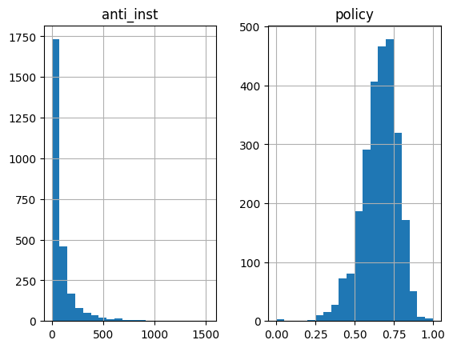

# Predicting Policy Discourse in Member of Congress

# 1. Introduction
This paper aims to investigate how often member of congress talk about policies in their speeches. As such, the dependent variable is a ratio from 0 to 1, where 1 represents a member that always talks about policies in their speeches, and 0 represents a member that never does.

The data comes from: *Predicting Anti-Institutionalism in Member of Congress' Tweets (Scott de Marchi, Michael Ensley, Max Gallop, Libby Jenke, and Shahryar Minhas). Duke University working paper.* Amongst the columns in the spreadsheet, we notably have access to an `anti_inst` variable, that measures how many tweets -from a particular member in one year- include anti institutional statements. Upon inquiry, it turns out both this variable and the dependent variable of this paper have been collected with the help of AI to classify certain tweets / speeches based on training data. Therefore, collected data might not always be completely accurate.

As you will find later in the paper, I had a choice between predicting the `policy` dependent variable (which I ultimately chose), or the `anti_inst` variable for this assignment.

## 1.1 Comments
The models, including their respective interpretations, feature selections, imputation and dropping data points, were made with assumptions about the American political system that could be wrong. Therefore, the assumptions of the models and other ideas listed below might be wrong.

## 1.2 Data “Cleaning” and Feature Engineering
Before looking at feature names and selection, imputation etc…, we can first clean part of the data in the csv file. The data can be imported like follows:

```python
import pandas as pd
import statsmodels.api as sm

# Read the CSV file into a DataFrame
df = pd.read_csv('dataset.csv')

# Create a summary table
summary_table = df.describe()
summary_table
```

The following rows can be dropped:

- **********************************************Duplicate rows**********************************************
    - `alpha_st` and `st` both represent the state of the concerned data: *drop `st`*
    - `primarychall` and `primchal` : *drop* *`primchal`*
    - `primaryvote` and `primvote` : *drop* *`primvote`*
    - `congress` and `name` both include the congress number (name also includes the state which we already have with `st`) ***drop `name`*
    - `Biden` `Trump20` `Clinton` `Trump16` `Obama` `Romney`, as the thermometer value of Biden, Clinton, Obama ≈ `dempvote` of that year, and Trumpy and Romney ≈ 1 - `dempvote`
    - Removed `white_acs` and `hispanic_acs` as the columns `white` and `hispanic` already contain that information (slightly different but negligible).
    - `Inc_dem` and `IncumbentDX` `IncumbentRX` (can get rid of all the variants of the latter, as 1 - `IncumbentDX` =`IncumbentRX`)
    - Furthermore, we can convert 2 columns that have inverse information such as `wongeneralD` and `wongeneralR` as they represent the same thing (R = 1 - D). Those can easily be found using collinearity between variables:

```python
from sklearn.linear_model import Lasso
import seaborn as sns
y = df['policy']
X = df.drop(['policy'], axis=1)

# highlight features with highest multicollinearity
corr = X.corr()
corr_abs = corr.abs()

# Get the features with the highest multicollinearity
features_with_highest_multicollinearity = corr_abs.unstack().sort_values(ascending=False).drop_duplicates().head()
features_with_highest_multicollinearity = features_with_highest_multicollinearity[features_with_highest_multicollinearity.index.get_level_values(0) != features_with_highest_multicollinearity.index.get_level_values(1)]
print(features_with_highest_multicollinearity)
```

This returns:

- 3 `wongenerals` and the 3 `GENERALD` and `GENERALR` (all the R were dropped)
- `dem_normal` and `dempvote` (latter was dropped as first is already standardized)
- ******************************************************Non informative rows******************************************************
    - `icpsr2`, `y1` to `y7` , which are just IDs.
    - Deleted District number
- ****************************Bottom columns****************************
    - Columns `2596` to `2619` have almost no data, and more importantly, are missing the dependent variable regardless of which one we choose
    - Most of 2022 data seems to not have been collected yet, therefore we can drop `2163` to `2997`
- ******************************“Name” columns******************************
    - `namedem`, `namerep` etc…. can be dropped as most of the values only appear once, and therefore wouldn’t help a decision tree, the data is not quantified, and therefore wouldn’t help a polynomial/linear model, and finally, there is a lot of missing data.
    - `incumbent` can be dropped as well as there are 428 unique values. This means it is useless for a linear model, and would require a lot of splits for a decision tree, making it non interpretable.
- ************************Data Transformation************************
    - Converted `Party` to `Inc_dem` which is a binary measure or whether the incumbent is democratic or not (as opposed to “D” and “R”)
    - Converted `pos_affect` and `neg_affect` to `posAffPer` which is `pos_affect` divided by the `num_tweets`. (`negAffPer` would just be `affect`- `posAffPer` ).
    - Converted `anti_inst` and count into a `antiInstPer` which is just the percentage of anti institutional tweets
        - For those two bullet points, one could argue that people with a low amount of total speeches/tweets could have a very high `pos_affect` and `antiInstPer` respectively. However, if they have very few total speeches/tweets, yet still talk positively / talk anti institutionally, that highlights that they are going specifically out of their “normal” conduct, and therefore, keeping it a percentage for those candidates should be fine.
    - Converted the 3 `dempvoteX` into one `dempvote` that concerns the previous elections: for range [2017-2019] it uses `dempvote16`, and for the rest it uses `dempvote20` (Note: This is the equivalent of using a **PCA**).
        - We can thus also drop all the columns containing absolute values of votes, such as `votesrep12020` etc… as those don’t mean anything without the state population and the percentage vote is already in `dempvote`
    - This can also be done with `uncontested` , `GENERALD` , and `PRIMARYD` and `PRIMARYR`, `numcandsD` and `numcandsR` , `primaryvote` and `primarychall`
    - This has already been done for `demHvote` meaning we can drop all the other ones.
    - Replaced `alpha_st` by `southEast` which is a binary variable indicating whether the state is southeastern or not as based in class (not sure the list is accurate)
        - Alabama, Florida, Georgia, Kentucky, Maryland, Mississippi, North Carolina, South Carolina, Tennessee, Virginia, and West Virginia

### This means we reduced **152** potential dependent variables (or columns) to **45**.

## 1.3 Dependent Variable
To choose which dependent variable we will use, we can check the normality of residuals and see if there is a significant difference in the distribution of the two variables. If there is, using the feature that is more normally distributed will allow us to make a better linear regression.

For that, we can use histograms, a Q-Q plot or a Shapiro-Wilk Test if needed. We can start by simply plotting frequency histograms:
```python
import pandas as pd
import statsmodels.api as sm

# Read the CSV file into a DataFrame
df = pd.read_csv('cleaned.csv')
df[['anti_inst', 'policy']].hist(bins=20) 
```
 

Those histograms have the values on the x-axis and the frequency of the range of values on the y-axis. As those diagram show, `policy` is more normally distributed than `anti_inst`, therefore we do not need to run other tests. Our dependent variable will thus be: `**policy**`

We can check whether `anti_inst` is more normally distributed if we divide it by the total number of tweets, labelling the variable `antiInstPer`. The right chart shows it is more normal than `anti_inst`, but `policy` is still the better dependent variable.
# 2. Feature Selection
Now that the data is cleaned and an dependent variable has been chosen, we can start looking at what the data means and selecting features.

Before, checking for multicollinearity, we can see that a lot of the **ideology** variables and the **economic** indicators are multicollinear within themselves. For example:

| Feature 1 | Feature 2 | Absolute Correlation  |
| --- | --- | --- |
| medinc | economic | 0.912814 |
| economic | poverty | 0.906188 |
| economic | college | 0.877797 |
| medinc | college | 0.861496 |
| pid7 | ideo5 | 0.817732 |

Thus, their dimensions should be reduced by using PCA, or some should be dropped if PCA cannot account for *most* of the variance when reducing the dimensionality. The value of the keyword *most* will depend from feature to feature, but is explained each time.

We thus first standardize the data:
```python
from sklearn.preprocessing import StandardScaler
# temporarily drop features with a lot of missing data to run PCA
y = X['policy']
X.drop(['PRIMARYD', 'PRIMARYR', 'GENERALD', 'wongeneralD', 'numcandsD', 'numcandsR'], axis=1, inplace=True)
X.dropna(inplace=True)
X.drop(['policy'], axis=1, inplace=True)

# Standardize the data
scaler = StandardScaler()
X_standardized = scaler.fit_transform(X)
# Convert the standardized array back to a DataFrame
X_standardized = pd.DataFrame(X_standardized, columns=X.columns)

X_standardized.dropna(inplace=True)
X_standardized.describe()
```
## 2.1 PCA
Several of the features can be merged by using PCA, to preserve the variance but reducing the features.
This can notably be applied to features that represent the same idea. The following ideas can be looked at:

- ************Demographic Features:************ `white` `hispanic` `black` `educ` `faminc` `unionmember` `ageless18` `age65plus` `armedforces` `foreignborn`

```python
# Run a PCA and plot the explained variance ratio
from sklearn.decomposition import PCA
pca = PCA()
pca.fit(X_standardized[['white', 'hispanic', 'black', 'educ', 'faminc', 'unionmember', 'ageless18', 'age65plus', 'armedforces', 'foreignborn']])
# Continue with PCA plot and feature selection

features = range(pca.n_components_)
plt.bar(features, pca.explained_variance_ratio_, alpha=0.5, label='Individual Variance')
plt.plot(features, np.cumsum(pca.explained_variance_ratio_), marker='o', linestyle='-', label='Cumulative Variance')
plt.xlabel('PCA feature')
plt.ylabel('Variance')
plt.xticks(features)
plt.legend()

# Plot the data points
plt.scatter(features, pca.explained_variance_ratio_, c='red', label='Individual Values')
plt.scatter(features, np.cumsum(pca.explained_variance_ratio_), c='blue', label='Cumulative Values')

# Label each data point with its value
for i, var_ratio in enumerate(pca.explained_variance_ratio_):
    plt.text(features[i], var_ratio, f'{var_ratio:.2f}', ha='center', va='bottom')

for i, cum_var_ratio in enumerate(np.cumsum(pca.explained_variance_ratio_)):
    plt.text(features[i], cum_var_ratio, f'{cum_var_ratio:.2f}', ha='center', va='bottom')

plt.legend()
plt.show()
```
Running a PCA, we can see that the PCA feature 4 represents 81% of the variance, which means we can reduce those 9 variables into 5 dimensions we can call `demographicPCA`.


```python
pca_result = pca.transform(X_standardized[['white', 'hispanic', 'black', 'educ', 'faminc', 'unionmember', 'ageless18', 'age65plus', 'armedforces', 'foreignborn']])
# select the PCA feature 5 and add it to X
for i in range(5):
    X[f'demoPCA{i + 1}'] = pca_result[:, i]
```
- **Ideology Features**: `nominate_dim1` `nominate_dim2` `op_ideo` `pid7` `ideo5`
*(Same code as above but with different features)*
Running a PCA, we can see that the PCA feature 0 represents 66% of the variance, while PCA feature 1 represents 18%, and so on (as shown in the graph below).


Knowing that the data on `policy` has around 80% accuracy after using chat gpt to classify the scores, explaining the full variance may not be needed as the models might be trying to fit to noise/wrong data too closely. Furthermore, having only one feature already explains 66% of the variance, so we can reduce the ideology features to a PCA of dimension 1, which we can call `ideoPCA`. We can drop the other ideology columns
```python
# select the PCA feature 0 and add it to X
X['ideoPCA'] = pca.transform(X_standardized[['nominate_dim1', 'nominate_dim2', 'op_ideo', 'pid7', 'ideo5']])[:, 0]
X.drop(['nominate_dim1', 'nominate_dim2', 'op_ideo', 'pid7', 'ideo5'], axis=1, inplace=True)
```
- **Economic Features**: `poverty` `unemp_clf` `college` `nilf` `medinc` `gini` `economic`


For the same reason as above, we can reduce it to one dimension. 

However, in this case, `economic` seems to be a combination of all the previous features. Therefore, we can drop the other features while keeping `economic`.

```python
X.drop(['poverty', 'unemp_clf', 'college', 'nilf', 'medinc', 'gini'], axis=1, inplace=True)
```
We are now at **23** columns. 
## 2.2 VIF
A lot of similar variables remain after running the PCA. Those include `democrat`, `Inc_dem`,`demHvote`, and `dem_normal` . 

Here, theory could be used to get rid of certain variables. However, because of my lack of knowledge about the American congress, another tool can be used in order to get rid of the variables with the highest multicollinearity, as having several variables that are highly multicollinear doesn’t help the model explain the dependent variable.

```python
from statsmodels.stats.outliers_influence import variance_inflation_factor

# Calculate VIF for each feature
vif = pd.DataFrame()
Xvif = X.drop(['policy'], axis=1)
vif["Feature"] = Xvif.columns
vif["VIF"] = [variance_inflation_factor(Xvif.values, i) for i in range(Xvif.shape[1])]

# Print the VIF values sorted from greatest to smallest
vif.sort_values(by='VIF', ascending=False)

print(vif)
```
Out of the variables above, `dem_normal` has the highest VIF score: 99.9. We can thus re-run the VIF after dropping it.

Furthermore, `approval_rep` has a VIF of 144.89. We can drop that variable as well.

We are now at **21** columns. 
# 3. Running models
## 3.1 Preliminary Model: XGBoost
In order to have a better idea of the achievable $R^2$ value for our model, we can run an XGBoost regression model. 

Our chosen hyperparameters are as follows:

- `learning_rate` : as the default is $0.1$, we can start with that and take smaller learning rates which take more time to boost but can result in better generalization:
    
    $$\text{learning rate} = [0.01, 0.05, 0.1] $$
    
- `max_depth` : The max depth of the tree should be small enough so the model is interpretable when running a normal decision tree. Anything above a depth of 4 has 62 or more splits, which - for me - makes it very long and difficult to interpret.

$$
\text{max depth} = [2,3,4]
$$

- `n_estimators` : We can use a large amount of trees as runtime is not really a problem for this assignment, while using `early_stopping_rounds` in order to stop the program slightly quicker if there is no improvement

$$
\displaylines{\text{n estimators} = [1000]\\ 
\text{early stopping rounds} = [100]}
$$

- A train test split will also be used to check our model’s Out of Sample MSE. The size of our test split can be relatively small as we have a lot of data, and overfitting to the test set is unlikely.
- Finally, we can use `k-fold` to cross validate. As mentioned before, run time isn’t a problem, and the dataset is relatively large. We can thus use a bigger value for k-fold than the default value.

$$
\text{cv} = 15
$$

```python
grid_search = GridSearchCV(estimator=xgb_model, param_grid=param_grid, scoring='r2', cv=15)
```

`Objective` can be left as the default, and `verbosity` will be set to 2 so we can see what the model is doing (just printing more information).

Note: This code may take a long time to run, so Google CoLab [https://colab.google/](https://colab.google/) can be used.

```python
param_grid = {
    'learning_rate': [0.01, 0.05, 0.1],
    'max_depth': [2, 3, 4],
    'n_estimators': [1000],
    'early_stopping_rounds': [100],
    'verbosity': [2],
}
```

```python
X_train, X_test, y_train, y_test = train_test_split(X, y, test_size=0.1, random_state=42)

# Define the XGBoost regressor (use XGBRegressor for regression tasks)
xgb_model = XGBRegressor()

# Initialize GridSearchCV
grid_search = GridSearchCV(estimator=xgb_model, param_grid=param_grid, scoring='neg_mean_squared_error', cv=15)

# Fit the model to the training data with a validation dataset
grid_search.fit(X_train, y_train, eval_set=[(X_test, y_test)], verbose=0)

# Get the best parameters from the grid search
best_params = grid_search.best_params_

# Create an XGBoost model with the best parameters
best_xgb_model = XGBRegressor(**best_params)

# Fit the model to the training data with a validation dataset
best_xgb_model.fit(X_train, y_train, eval_set=[(X_test, y_test)], early_stopping_rounds=100, verbose=0)

# Make predictions on the test set
y_pred = best_xgb_model.predict(X_test)

# Evaluate the model using R-squared
r2 = r2_score(y_test, y_pred)
print("Best R-squared Score:", r2)
print("Best Hyperparameters:", best_params)
print("Best MSE:", -grid_search.best_score_)
```

We get the following result:

$$\displaylines{\text{Best } R^2 \text{ Score: } 0.38290203521283595\\
\text{Best Hyperparameters: [learning rate: 0.1, max depth: 4, n estimators: 1000]} \\
\text{Best MSE: }0.008047822276907663}$$ 

**Observation:** running the XGBoost with `scoring` set to $R^2$ or $MSE$ results in the same answer. This means we do not have to choose which scoring to use.*

This R-squared score is surprisingly low. **As I included all the variables** into the XGBoost model, this likely means I won’t be able to find a linear model or a decision tree that will be “good”, especially after dropping most variables. This thus shows that either my feature engineering accidentally deleted some valuable data, that the policy score of candidates isn’t predictable based on our data, or that we simply need to collect more data. 

I will still run a linear model to try to interpret the data. However, as we still have **21** independent variables, we can run a lasso regression to pursue feature selection.

## 3.2 Lasso Regression
We can first plot a lasso chart with the x-axis representing the penalty function, and the y-axis representing the features, as to observe them drop to 0. The range of alpha values can be adjusted based on if we can see variables get dropped in the current window. I ended up with a final window of $10^{-4} \text{ to } 10^0$. (We can leave it as bigger in the code, and just reduce the window to what interests us using `plt.axis('tight')`. I also reduced the y-axis so watching the features drop was easier.
```python
X2.drop(['demoPCA1', 'demoPCA2',  'demoPCA3', 'demoPCA4', 'demoPCA5', 'ideoPCA'], axis=1, inplace=True)
# Set a range of alpha values
alphas = np.logspace(-4, -0.5, 30)

# Initialize an empty list to store coefficients for each alpha
coefs = []
colors = ['blue', 'orange', 'green', 'red', 'purple', 'brown', 'pink', 'gray', 'olive', 'cyan', 'magenta', 'yellow', 'teal', 'navy', 'lime', 'maroon', 'aqua', 'silver', 'fuchsia', 'gold']

# Fit Lasso regression for each alpha and store coefficients
for alpha in alphas:
    lasso = Lasso(alpha=alpha)
    lasso.fit(X2, y2)
    coefs.append(lasso.coef_)

# Plot the results
plt.figure(figsize=(20, 6))

ax = plt.gca()
lines = ax.plot(alphas, coefs)
ax.set_xscale('log')
plt.xlabel('alpha')
plt.ylabel('coefficients')
plt.title('Lasso coefficients as a function of the regularization')
plt.axis('tight')

# Assign different colors to the lines representing each feature
for i, line in enumerate(lines):
    line.set_color(colors[i % len(colors)])

plt.legend(X2.columns, loc='right')
plt.ylim([-0.05, 0.05])

plt.show()
```


The chart shows that the variables that get dropped first. As the colors are difficult to differentiate, we can just manually print the variables in the order that they get dropped.

```python
zero_variables = []
seen_variable = []
for i, coef in enumerate(coefs):
    zero_indices = np.where(coef == 0)[0]
    zero_variables.extend(X2.columns[zero_indices])

# Print the variables in the order that they reach 0
for variable in zero_variables:
    if variable not in seen_variable:
        seen_variable.append(variable)
        print(variable)
```

The first 6 variables that get dropped are: `posAffPer`, `Inc_dem`, `demHvote`, `primaryvote`, `antiInstPer`, `ideoPCA`, `southEast`

## 3.3 Linear Regression

Running a linear regression with the remaining variables and adding a constant variable (with a `kfold` of $15$  and a `test size` of $0.1$ as explained for the XGBoost), we get the following model. ****(Rounded to 3 decimal places for simplicity)****

$$\displaylines{\text{Out-of-Sample }R^2: 0.186\\
\text{Mean Squared Error: }0.00965\\
policy = 0.049 -0.017 \text{ affect} + 0.046 \text{ approval pres} + 0.005 \text{ democrat} -0.005 \text{ seniority} + 0.011 \text{ economic} -0.002 \text{ uncontested} -0.007 \text{ primarychall} + 0.012 \text{ demoPCA1} + 0.012 \text{ demoPCA2} + 0.003 \text{ demoPCA3} + 0.002 \text{ demoPCA4}}$$

```python
X2.drop(['posAffPer', 'Inc_dem', 'demHvote', 'primaryvote', 'antiInstPer', 'ideoPCA', 'southEast'], axis=1, inplace=True)
X_train, X_test, y_train, y_test = train_test_split(X, y, test_size=0.1, random_state=42)
X2 = sm.add_constant(X2)

from sklearn.linear_model import LinearRegression
from sklearn.metrics import r2_score, mean_squared_error
from sklearn.model_selection import KFold

n_folds = 15

# Initialize an empty list to store the R-squared scores
r2_scores = []

# Initialize an empty list to store the MSE scores
mse_scores = []

# Initialize an empty list to store the model coefficients
coefficients = []

# Create a KFold object
kf = KFold(n_splits=n_folds, shuffle=True, random_state=42)

# Perform k-fold cross-validation
for train_index, test_index in kf.split(X2):
    X_train_fold, X_test_fold = X2.iloc[train_index], X2.iloc[test_index]
    y_train_fold, y_test_fold = y.iloc[train_index], y.iloc[test_index]

    # Add the constant term to the training data
    X_train_fold = sm.add_constant(X_train_fold)

    # Create a linear regression model
    linear_model = LinearRegression()

    # Fit the model to the training data
    linear_model.fit(X_train_fold, y_train_fold)

    # Add the constant term to the test data
    X_test_fold = sm.add_constant(X_test_fold)

    # Predict the target variable for the test data
    y_pred_fold = linear_model.predict(X_test_fold)

    # Calculate the R-squared score for the fold
    r2_fold = r2_score(y_test_fold, y_pred_fold)

    # Calculate the MSE for the fold
    mse_fold = mean_squared_error(y_test_fold, y_pred_fold)

    # Store the R-squared score and MSE for the fold
    r2_scores.append(r2_fold)
    mse_scores.append(mse_fold)

    # Store the model coefficients
    coefficients.append(linear_model.coef_)

# Calculate the average R-squared score and MSE across all folds
avg_r2_score = np.mean(r2_scores)
avg_mse_score = np.mean(mse_scores)

# Print the average R-squared score and MSE
print("Average R-squared score:", avg_r2_score)
print("Average Mean Squared Error:", avg_mse_score)

# Get the feature names
feature_names = X2.columns

# Initialize an empty list to store the average coefficients
avg_coefficients = []

# Calculate the average coefficient for each feature across all folds
for i in range(len(feature_names)):
    avg_coefficient = np.mean([coefficients[j][i] for j in range(n_folds)])
    avg_coefficients.append(avg_coefficient)

# Create the model string
model_string = "policy = "
for i, feature in enumerate(feature_names):
    model_string += f"{avg_coefficients[i]:.3f}{feature} + "
model_string = model_string[:-3]  # Remove the last " + "

print(model_string)
```

# 4. Conclusion

**The story of our linear model is that:**

- `affect`, which is how much a politician talks about their party (both positively or negatively), negatively affects how much they talk about policy. This makes sense as if they take the time to talk about their party, they have less time to talk about their policies
- If they approve of the president (`approval pres`), they are more likely to talk about policies (I cannot explain why this is true)
- `Democrats` are more likely to talk about policies than republicans (needs to be fact checked)
- Younger politicians are more likely to talk about their policies than older candidates (`seniority`). This maybe due to the fact that they have more ideas of policies to implement compared to their older counter parts that have already (tried to) implement their policies
- A good `economy` pushes candidates to talk about policies more than if the economy is bad. This is very surprising as usually the opposite is expected - if the economy is bad, candidates should be talking about policies to improve the situation. Maybe this has something to do with the fact that rich people can help candidates by providing funds for their campaigns?
- If the candidate is `uncontested`, they are more less likely to talk about policy - this makes sense as less concrete policies are required if there is no competition, whereas if there was competition, candidates may feel forced to present specific ideas to their audience.
- `Demographics` heavily impact whether a candidate discusses policy or not. Although the interpretability of the model is reduced due to the use of a PCA, demographics include age, origin and other factors. It is definitely plausible that those play a role in whether the candidate should discuss policies or not.

However, the high MSE and low $R^2$ suggests this is a very poor model. and no real conclusion can be written from the linear regression alone. 

Combining the results with the results of our XGBoost, we can conclude that it is hard to predict how much a politician is going to talk about policy with the data available to us. The XGBoost model seems to do a relatively good job at predicting it, considering it is real world data ($R^2$ of $0.4$ is not necessarily *bad*) and the data has inaccuracies due to the use of AI to classify data etc…. However, a problem with this model is that it isn’t interpretable. On the other hand, the linear model gives mixed signals about the problem as some relationships make sense, while the inverse of what is expected is observed for other features, such as `economic`.

When redoing this model, collecting different data (such as more contextual data - especially about the direct competitors of the political candidates) may be useful. As data is collected before 2022, Chat GPT can actually do a good job at providing information about candidates and context (although sometimes false), and this can easily be automated using their API. 

Furthermore, more attention should be given to the columns on the right of the dataset which had a lot of missing data but could have been combined in interesting ways - more research about the topic would have been necessary.

In conclusion, no clear model can be made to predict how much politicians talk about policies in their speeches, as it seems dependent on variables that we do not have here. However, even though we couldn’t return a “good” final model, this has been an interesting investigation as we applied many different tools to try to improve our understanding of members of congress.
